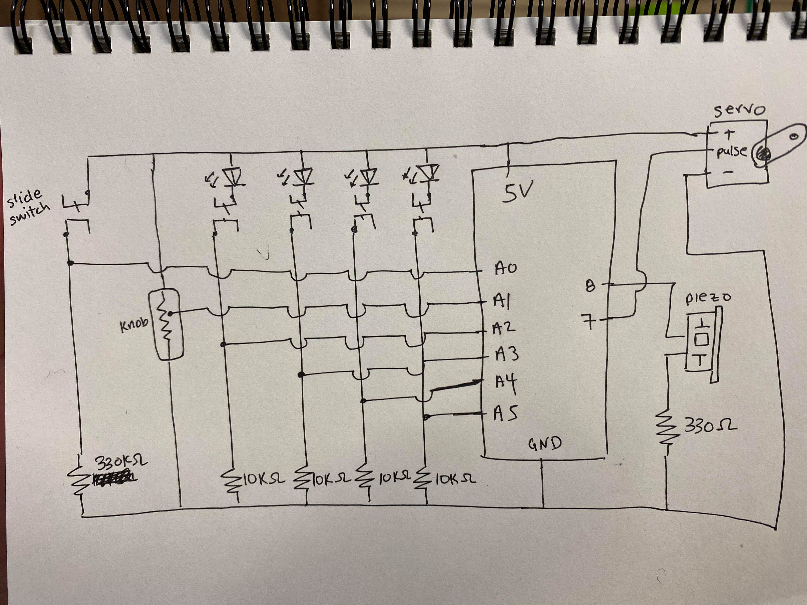
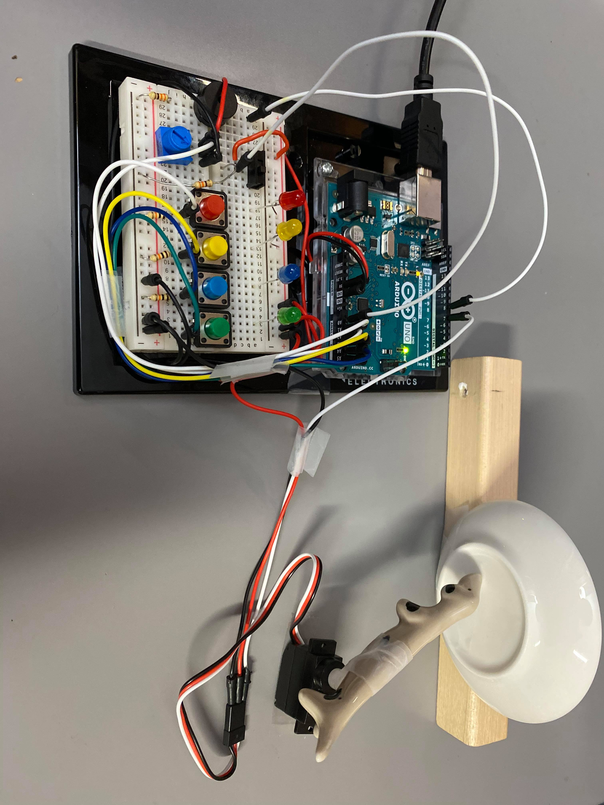
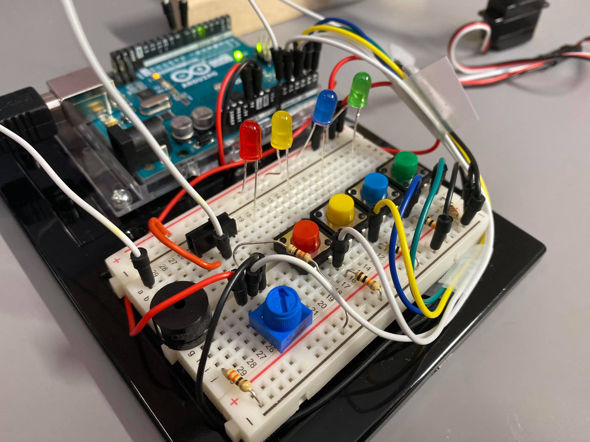

## Musical Instrument Assignment

#### Description of Project:

* My project is an instrument which can play 16 notes (2 octaves) in a piano like fashion, using a potentiometer (knob) to adjust the range of the notes you're playing within the octaves. You can also add additional notes by simply adding them to the notes.h file in order of red --> yellow --> blue --> green arrays in ascending note order. The slide switch is used to turn on a metronome which is powered by a servo motor. It has a little ceramic dog taped onto it and it very lightly hits a small sauce dish to keep time like a metronome! 

#### Anything clever or tricky:

* I used arrays to keep track of which notes each button should play (depending on what the potentiometer value is). This made it really easy to add notes and use the potentiometer to easily cycle up 4 notes or cycle down 4 notes.

#### Problems (if any) and how you overcame them:

* One problem that I had was that my blue button wasn't working. It was a really weird problem because the circuit was working just fine (the blue light came on which connected the circuit) and when I tried other input pins and even replacing the button it still wouldn't work! After checking all the code multiple times for a potential bug and racking my brain over this problem, I reset the Arduino IDE and that suddenly fixed it. Note to future self: if there seems to be a bug and you can't find the bug, try resetting the IDE.

#### Schematic:

#### Link to short video of instrument being played

#### Photograph of instrument

#### Closeup of electronics

