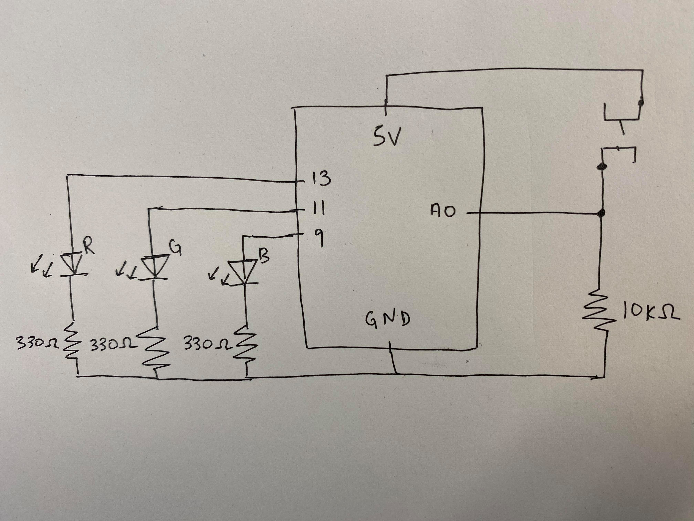
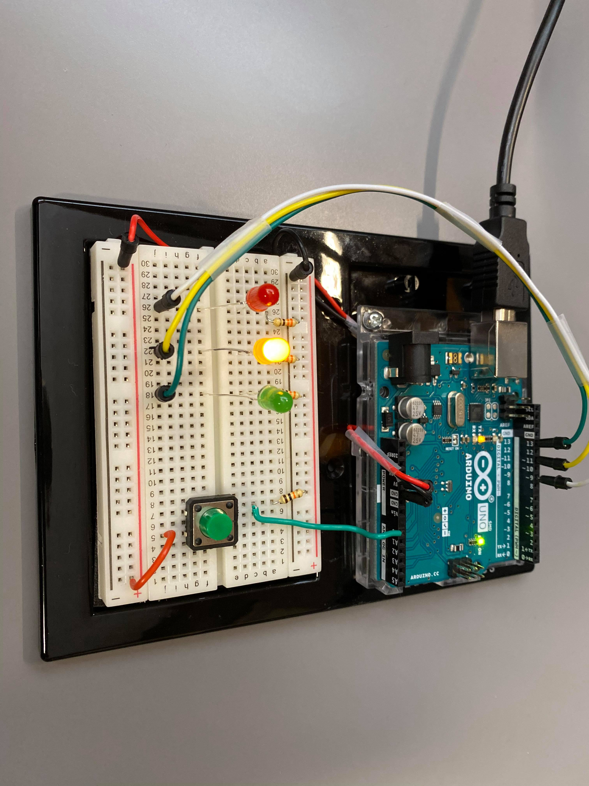
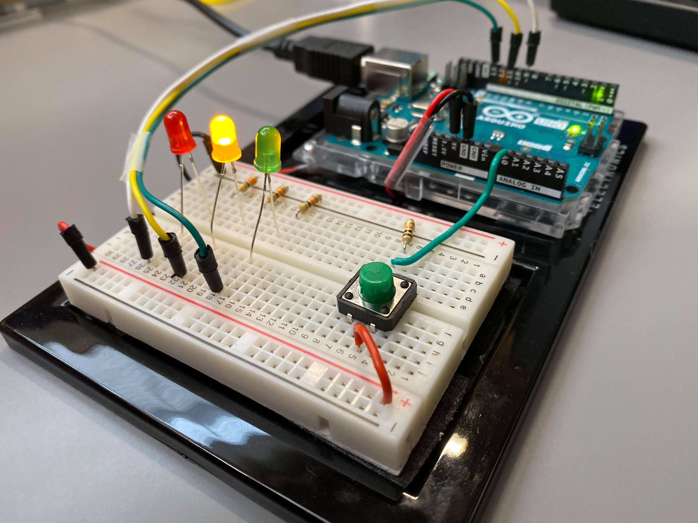

## Midterm Update Assignment using Arduino Input

#### Description of Project:

* My update displays an LED "stoplight" output on the arduino and when the light hits green, it means that you have a powerup available in my midterm game "Bunny Ball". This powerup increases your player speed, your ball speed, the number of balls you have, and how quickly you reload. It also lowers the speed of all enemies in the proceeding rounds, as long as you clear the current stage in time! I call this power up "Matrix Mode". 

* New Arduino .ino file is named arduino_powerup.ino, and must be ran before running Bunny_Ball.pde. You still need to change your paths for all the sprites, menu icons, and sound files as well if you want to run the game on your own computer! Please change the paths in entityLoad.pde and the arduino path index in Bunny_Ball.pde.

#### Anything clever or tricky:

* I found that reading input from my arduino was really tricky, especially when trying to include arduino input on a project that was already expansive and working beforehand. A lot of the changes that I implemented in order to try and get the arduiuno input to work made other facets of my program stop working, which made it really difficult to debug. I had to go through all the conditionals that I set to check different game states and triple check their implementation to make sure it was correct.

#### Problems (if any) and how you overcame them:

* I was having a problem where the arduino input and output was working correctly and the game states were changing correctly to account for the "power up" mode from the arduino button push, but I'm wasn't able to use my directional keys to move my character anymore. It seemed like the game was still detecting the directional keys being pressed because I could shoot the ball in different directions, but my character remained stationary. After checking my conditionals multiple times after adding arduino functionality into the game, I realized that I had missed setting a crucial conditional that changed my character's speed. It instantly kept reducing my character's speed until it was 0, which made me unable to move. Once I fixed this conditional statement error, the problem went away!

#### Schematic:

#### Photograph of arduino:

#### Closeup of electronics:

#### Video:

