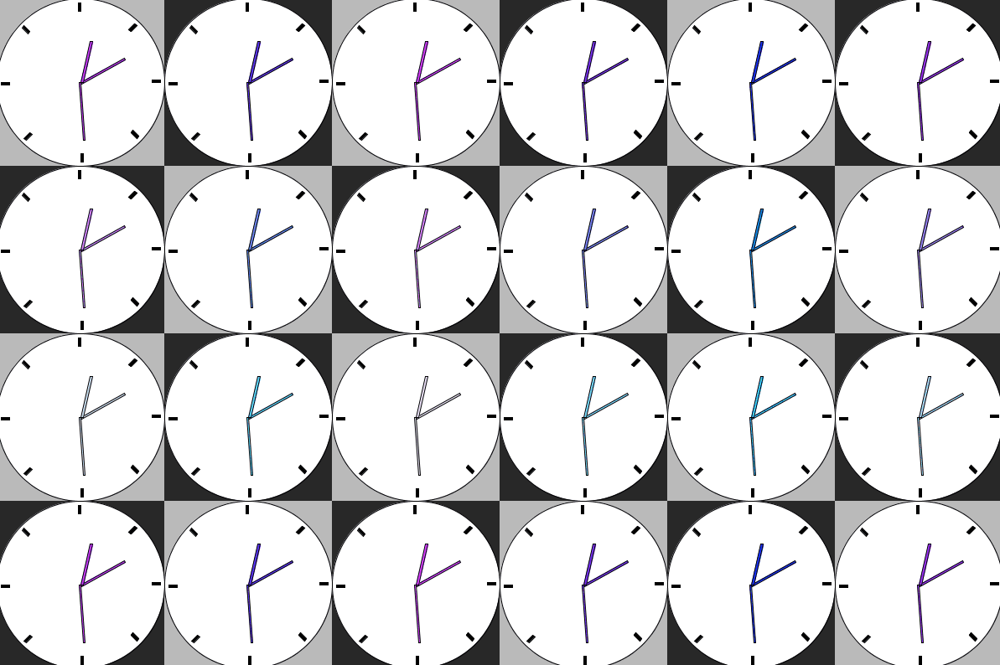

## Generative Art with Patterns

#### Describe your inspiration, and include links:

* My inspiration for this art piece was the walkthrough example we did in class where we learned how to use the frameCount system variable and watched the colored bars rotate around the center of the canvas. I thought it was really cool how you could use 2D transformation functions in conjunction with loops to very easily create animation. After thinking about that example and what I wanted to do with this assignment, I decided that I wanted to make a piece with clocks to represent how time has slowed down for all of us during quarantine. Being stuck indoors everyday due to shelter-in-place (not mandatory now, but recommended in California) is very taxing and not being able to have close contact with other people outside of your home situation is tiring as well. People are becoming more and more fatigued, and with this, it's easy to get depressed and feel like time is moving slower and slower. If you're feeling this way, you're not alone! We're all feeling these emotions to some extent and could all use some fresh air, a walk around the neighborhood, and interesting conversations to pick us back up. My hope is that this piece reminds you that the most important thing right now is to care for your own emotional and physical health and to work toward regaining intention in your life if you think you've lost it during this pandemic. I'm rooting for you. :)

  * **Note:** When showcasing my project during class on July 13th, Professor Shiloh mentioned that it reminded him of Andy Warhol's artwork. It wasn't my initial intention when I was making my project, but I definitely see the resemblance when I look at Andy Warhol's pieces retroactively. If you aren't familiar with Andy Warhol and his art like I was before this class, check out his art !

#### Describe the rules you used to create this artwork and briefly how you programmed this to happen:

* There were 3 rules/patterns that I used to create this artwork:

  * The first rule was that the background would be a checkerboard pattern. I wanted a checkerboard pattern as the background so that each individual clock would have its own colored square to sit inside of and to create contrast in the piece. In order to do this, I cycle through the x-coordinates and the y-coordinates of the canvas using a for loop and created a square at each (x, y) coordinate pair (going in increments of 200 pixels in both directions). In order to get the checkerboard pattern, I alternated the color depending on whether the sum of the x-coordinate and the y-coordinate was evenly divisible by 400 or not (using the modulo operator). This allowed me to cleanly alternate colors without having to repeat code in my for loop.

  * The second rule was that each checkerboard square would have a clock pattern on it. I created each clock by using a for loop along with 2D transformation functions to move each clock into the correct position, the ellipse function to create the clock exterior, and the rectangle function to create the tick marks around the clock.

  * The third rule was that my program would monitor the current positions for the second hand, minute hand, and the hour hand of the clock and move them accordingly when it was the time to do so. I achieved this by making a helper function outside of my draw function called "drawClockHand", which took in the position of the clock hand, its width, and its height, and drew the respective hand in the correct position of every clock. I tracked the time accurately by setting the frameRate to 10 FPS and using a conditional statement (eg. frameRate % 10 == 0) to only update the each clock hand at the appropriate time interval. By doing this, I was able to make each clock hand move at the correct time. I also slowed down the rate at which each clock hand moves so that it's 0.5 times slower than real time, because I wanted to convey this feeling of time slowing down due to shelter-in-place.

#### Describe any difficulties you had and how you overcame them:

* One of the major difficulties I had with this project was getting the clock hands to move appropriately. It would frequently bug out and show the clock hands in the incorrect locations, show them moving at incorrect intervals around the clock, or not show at all. It took a lot of fine tuning in order to get even one of the clock hands to move correctly for every single clock I had in the piece, but once I figured it out for one of the clock hands, I was able to abstract this code out of the draw() function and into its own function so that I could use it for the other clock hands as well. 

* Another one of the difficults I had was trying to get the checkerboard pattern correct for the background. I was using nested for loops and was running into issues where either the entire canvas was a single color, the canvas was split into columns or rows of different colors, or some of the colors were spread out along the canvas in some seemingly random orientation. I was able to overcome this issue by actually drawing out the canvas on a piece of paper and labeling the top left corner of each square with its (x, y) coordinate pair. By doing this, I was able to figure out the correct algorithm for my code in order to get the checkerboard pattern for the background. Trying to construct a mental representation of the checkerboard to visualize my algorithm was unnecessary and inefficient when I could have just drawn a diagram for it! 

#### Mention anything interesting you discovered while doing this assignment:

* One of the interesting things that I discovered was how versitile using the frameCount system variable would be for animations. Simply by manipulating the frameRate inside the draw() function, you're able to slow down or speed up the rate of your animation however you want (after adjusting the frames where your code updates the animation)! 

* Additionally, after learning about the "ctrl + t" command to auto clean the formatting of your code in class last week, I found it INCREDIBLY helpful when formatting my code for this assignment. Because I had many nested for loops as well as conditional statements, there were a LOT of brackets and indentation that I had to worry about, but using this auto formatting command made my life a lot easier. I'm still frustrated that there isn't a built-in bracket auto completion, but maybe I'll find a workaround for that in the future! 

##### Below is a short gif of my project. If you want to run the code locally on your own computer to see it run fully (and indefinitely), feel free to use my code to do so!

