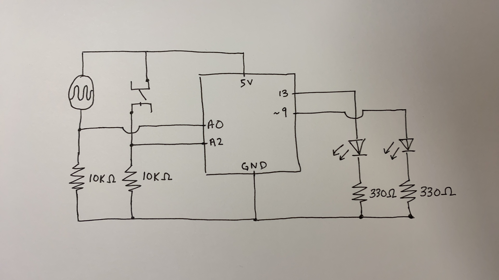

## Arduino Basics Assignment

#### My program:

* My program is supposed to simulate day-to-night transitions using the photoresistor and lightning strikes using the button. When you cover the photoresistor, the yellow light fades to no light and when you aren't covering the photoresistor, the yellow light fades back in. When you press the blue button, you signal a series of random lightning flashes with the blue light. 

