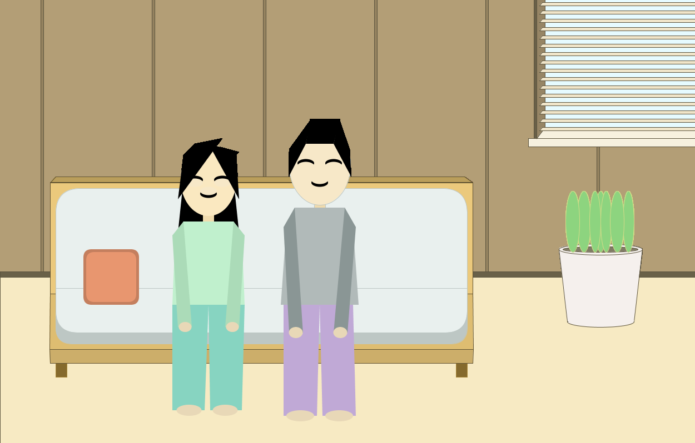

# Here is the portrait I made on Processing!

My portrait is of me and my partner's first home together. I moved out of my apartment in Berkeley around the end of May (due to COVID-19, online courses, and because I'm graduating in the Fall) and my partner got a job offer earlier this year. Because of these two events, we decided to take the leap and move in together. It took A LOT of time and effort, but we were able to convince our more traditionally minded parents that we would be fine living together. We just moved in recently (roughly 6 weeks ago) and are extremely excited to start this new chapter of our lives!

The person on the right is me (Norman) and the person on the left is my partner (Lily). I chose to draw us sitting on our couch in the living room with the window blinds open and our snake plant enjoying the sunlight. 

In terms of using Processing for the first time and any difficulties I encountered, I found that it was really tedious to have to guess coordinates to use as my parameters for the built-in shape functions. I was frequently guessing and adjusting my numbers over and over until I found the correct position for my shapes. I also found the number of shapes available to be kind of limiting, but this makes sense given that you need to input parameters for every single shape you wanted to make. In terms of interesting thoughts I had about Processing and this drawing experience, I found that making patterned objects (like the window blinds in my picture) very easy to do using For loops!

Credits:

I used references for shapes and built-in functions listed in the Processing references page:
[Processing Reference Page](https://processing.org/reference/)

I also used Google's RGB color picker to find my colors:
[Google RGB color picker](https://www.google.com/search?q=rgb+color+picker&rlz=1C1CHBF_enUS887US887&oq=rgb+&aqs=chrome.0.69i59j69i57j0l6.821j0j7&sourceid=chrome&ie=UTF-8)
