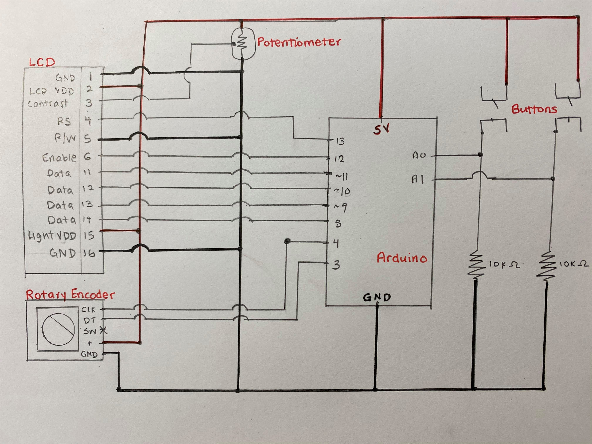
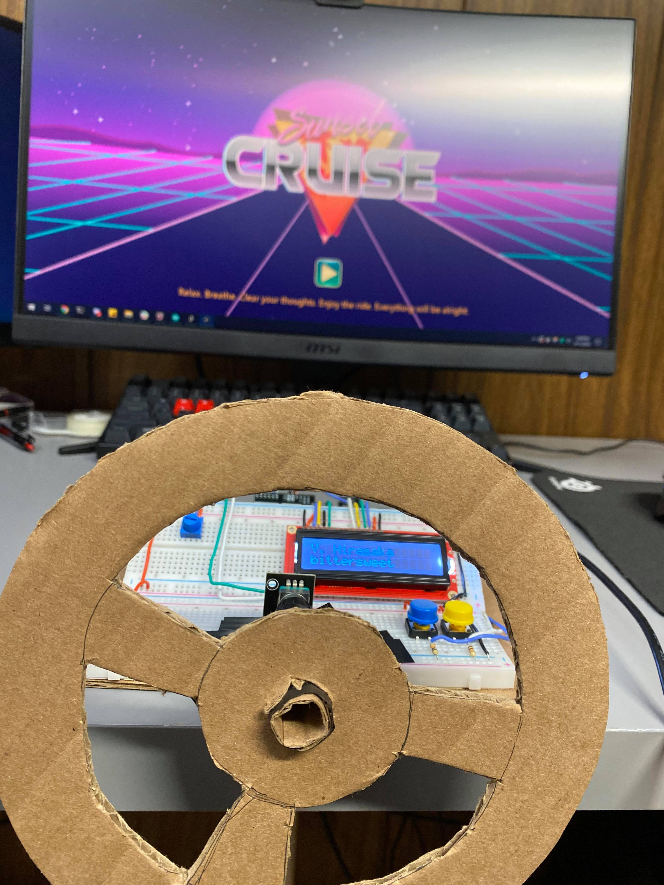
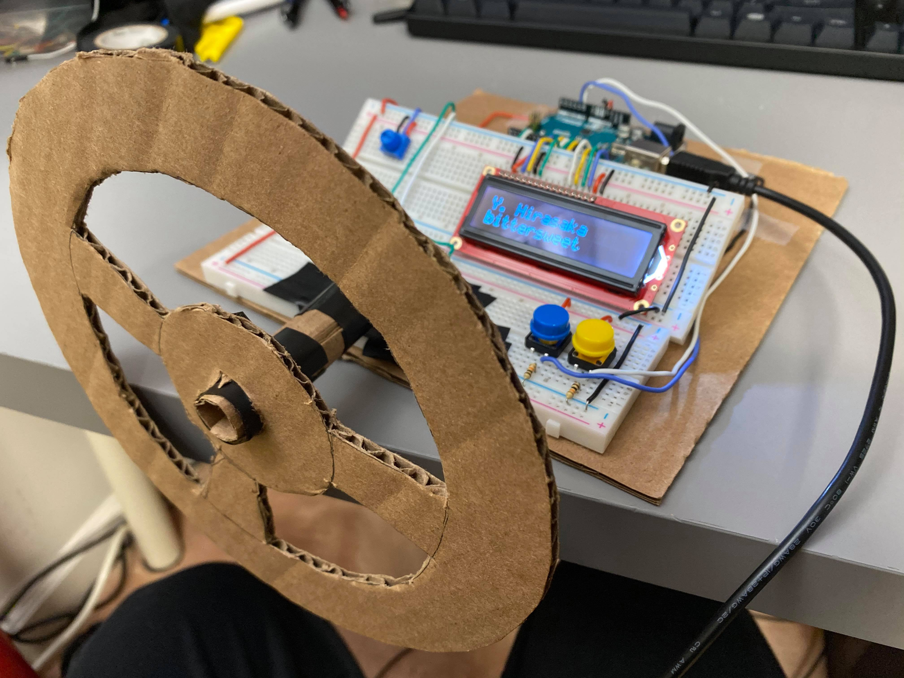
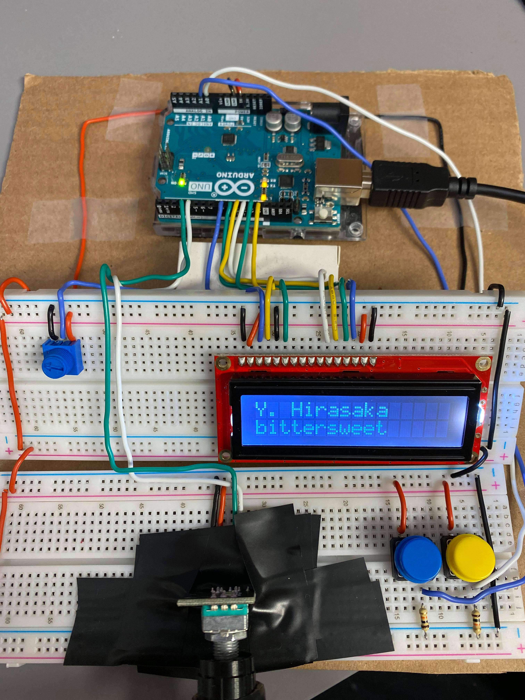

## Final Project: Sunset Cruise

#### Description of Project:

* My final project is a game/interactive experience called "Sunset Cruise". It's a relaxing, late night driving experience, where you drive a car on an empty stretch of the highway to chill lofi music. During the drive, you can choose between 7 different songs from the radio and you can cycle between them as you wish. All of the art is drawn with code in Processing (except for the title screen logo) and you control the car and the radio using Arduino input. 

#### Clever and/or Tricky Implementations:

* In order to make the game look like it was smoothly animated, I included buffer frames for every moving entity so that they wouldn't update too quickly. The buffer frames give the human eye some time to notice and react to the moving particles first before it goes on to the next frame. If there was no buffer included, the frames would animate too quickly and the animation would appear choppy to the human brain.

* To produce a glowing effect for the sun, I repeatedly drew more transparent versions of the sun slightly transposed higher on the y-axis behind the sunset. This gave the sunset the appearance of being more 3D and actually giving off light like a real sunset would. To accompany this, I chose complementary colors and used gradients to give the appearance of the sunset being a lightsource in the background.

#### Problems I encountered and how I overcame them

* One of the biggest problems that I encountered was multiple serial communication. Serial communication between Arduino and Processing when using multiple sensors and buttons is very frustrating and not very straightforward. Many times I would have to restart my Processing sketch simply because there was an internal problem with Processing and trying to read in bytes from the Arduino. I attempted to use this alternate, open-source library called AP-Sync, which tries to effortlessly sync the Arduino and Processing public variables with each other, but unfortunately it hasn't been updated in many years and is thus very buggy as well. In the end, I just had to push through this issue with multiple serial communication and restart my Processing sketch before running it every time, which fixed my issue entirely.

#### Schematic:

#### Photograph of project

#### Closeup of electronics:

#### Video:

